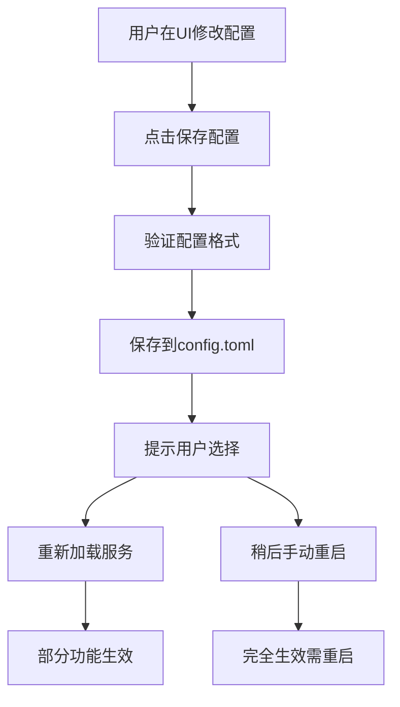

# 📋 配置管理详细说明

## 🗂️ 配置存储位置

### 1. **主配置文件**
- **位置**: 项目根目录 `config.toml`
- **类型**: TOML格式静态配置文件
- **作用**: 应用启动时读取的基础配置

### 2. **运行时配置**
- **位置**: 应用内存中
- **类型**: 动态可修改的配置
- **作用**: 通过UI界面可以实时修改

### 3. **配置备份**
- **位置**: `config.local.toml` (本地开发模板)
- **位置**: `.env.example` (环境变量模板)

## 🔄 配置修改和重连机制

### 当前实现方式

#### ✅ **支持的功能**
1. **实时配置修改** - UI界面可修改所有配置项
2. **配置文件保存** - 修改后可保存到 `config.toml`
3. **单服务测试** - 可单独测试每个服务连接
4. **配置验证** - 保存前进行基本验证

#### ⚠️ **限制说明**
1. **需要重启应用** - 配置修改后需要重启才能完全生效
2. **部分服务热重载** - 目前支持连接测试，但不支持完全热重载

### 配置修改流程



## 🛠️ 使用方法

### 1. **修改配置**
1. 打开应用，导航到"配置管理"页面
2. 在对应标签页修改配置项
3. 点击"测试连接"验证配置是否正确
4. 点击"保存配置"保存到文件

### 2. **应用配置**
配置保存后有两种选择：
- **立即重新加载** (部分生效)
- **重启应用** (完全生效，推荐)

### 3. **配置验证**
```typescript
// 测试单个服务连接
await invoke('test_connection', { service: 'mariadb' })
await invoke('test_connection', { service: 'influxdb' })  
await invoke('test_connection', { service: 'kafka' })

// 保存配置
await invoke('save_config', { config: configData })

// 重新加载服务 (有限支持)
await invoke('reload_services', { config: configData })
```

## 📁 配置文件结构

### config.toml 格式
```toml
# 服务器配置
[server]
host = "127.0.0.1"
port = 8080

# MariaDB配置
[mariadb]
host = "localhost"
port = 3306
database = "device_data"
username = "root"
password = ""

# InfluxDB配置  
[influxdb]
url = "http://localhost:8086"
database = "device_signals"
# username = "admin"  # 可选
# password = "password"  # 可选

# Kafka配置
[kafka]
brokers = "localhost:9092"
topic = "device-signals"
client_id = "tauri-device-gateway"
```

## 🔧 错误处理

### 常见情况和解决方案

#### 1. **启动时配置错误**
**现象**: 应用启动失败或服务连接失败
**解决**: 
- 检查 `config.toml` 文件格式
- 确保数据库和Kafka服务正在运行
- 使用UI配置管理页面修改配置
- 或者复制 `config.local.toml` 到 `config.toml`

#### 2. **修改配置后连接失败**
**现象**: 保存配置后测试连接失败
**解决**:
- 重新检查配置参数
- 确保目标服务可访问
- 尝试恢复之前的配置
- 重启应用以完全应用更改

#### 3. **配置文件损坏**
**现象**: 配置加载失败
**解决**:
- 恢复备份配置: `cp config.local.toml config.toml`
- 或使用环境变量覆盖配置
- 或手动编辑修复配置文件

## 🚀 高级配置

### 环境变量覆盖
即使config.toml配置错误，也可以通过环境变量覆盖：

```bash
# 设置环境变量
export APP_MARIADB_HOST=localhost
export APP_MARIADB_PASSWORD=yourpassword
export APP_KAFKA_BROKERS=localhost:9092

# 启动应用
pnpm tauri dev
```

### 配置优先级
1. **环境变量** (最高优先级)
2. **config.toml文件**
3. **默认值** (最低优先级)

## 💡 最佳实践

### 1. **开发环境**
- 使用 `config.local.toml` 作为本地配置模板
- 不要将含有敏感信息的配置提交到版本控制
- 定期备份工作配置

### 2. **生产环境**
- 使用环境变量设置敏感配置 (如密码)
- 定期测试配置连接状态
- 保持配置文件的备份

### 3. **配置修改**
- 修改配置前先测试连接
- 保存重要配置的备份
- 修改后重启应用以确保完全生效

## 🔮 未来改进计划

### 计划中的功能
1. **完整热重载** - 支持不重启应用的配置更新
2. **配置历史** - 支持配置版本管理和回滚
3. **配置模板** - 预设的环境配置模板
4. **配置验证** - 更强的配置验证和错误提示
5. **配置加密** - 敏感信息的加密存储

### 实现复杂度
- **热重载**: 需要重构服务架构，支持服务实例的动态替换
- **配置加密**: 需要添加加密/解密功能
- **配置历史**: 需要持久化存储和版本管理

目前的实现已经能够满足大部分使用场景，通过UI可以方便地管理配置，只是在完全应用更改时需要重启应用。